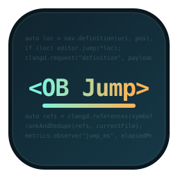

# OpenBMC Jump



面向 OpenBMC 的轻量 C/C++ 代码跳转 VS Code 扩展。

## 当前能力
- Go To Definition
- Go To Declaration
- Go To Implementation
- Find References
- Restart clangd
- Show Active Compile DB
- Select Compile DB
- Show Clangd Status
- Diagnose Current File
- Analyze Core Dump（右键菜单）
- 基础性能采样（状态栏 + Metrics 输出）
- 支持 VS Code 原生跳转入口（F12、右键 Go to Definition、Shift+F12）

## 配置项
- openbmcJump.clangd.path: 自定义 clangd 可执行文件路径。
- openbmcJump.compileCommands.path: 自定义 compile_commands.json 路径。
- openbmcJump.compileCommands.searchRoots: 递归搜索 compile_commands.json 的根目录列表，默认适配 build 和 tmp。
- openbmcJump.compileCommands.maxSearchDepth: 递归搜索深度，默认 6。
- openbmcJump.requestTimeoutMs: 跳转请求超时毫秒数。
- openbmcJump.autoRestart: clangd 异常退出后是否自动重启。
- openbmcJump.autoRestartDelayMs: 自动重启延迟毫秒数。

## 本地开发
```bash
npm install
npm run compile
```

## 版本规则
- `0.1.x`: 修复问题、日志增强、小范围兼容性调整。
- `0.x.0`: 新增用户可见功能、命令、OpenBMC 场景能力增强。
- `1.0.0`: OpenBMC 主场景稳定、基础跳转与编译数据库选择链路可长期使用。

## 快速验证（推荐）
1. 打开调试面板，选择 Run OpenBMC Jump，然后按 F5。
2. 在新打开的 Extension Development Host 中，打开 samples/minimal-project/main.cpp。
3. 将光标放到 add 调用处，执行以下命令：
- OpenBMC Jump: Go To Definition
- OpenBMC Jump: Go To Declaration
- OpenBMC Jump: Go To Implementation
- OpenBMC Jump: Find References
4. 执行 OpenBMC Jump: Show Metrics，查看采样日志。
5. 如需验证自动恢复，可手动结束 clangd 进程，扩展会按配置自动重启。

## Core Dump 右键使用
1. 在资源管理器中右键 `core`、`core.1234` 或 `xxx.core` 文件。
2. 选择 OpenBMC Jump: Analyze Core Dump。
3. 在弹窗中选择对应可执行文件。
4. 扩展会打开终端并执行 gdb 分析命令。

## 预期结果
- Definition/Implementation 跳到 util.cpp 中的 add 定义。
- Declaration 跳到 util.h 中的 add 声明。
- References 展示 main.cpp 与 util.cpp 中的相关位置。

## 样例工程
- samples/minimal-project/main.cpp
- samples/minimal-project/util.h
- samples/minimal-project/util.cpp
- samples/minimal-project/compile_commands.json

## OpenBMC 使用建议
1. 优先直接配置 openbmcJump.compileCommands.path 指向实际编译产物中的 compile_commands.json。
2. 如果不想手工配置，可保留自动发现，并把 openbmcJump.compileCommands.searchRoots 设为 OpenBMC 常见目录，例如：
- build
- tmp
- build/<machine>
3. 对于大型 OpenBMC 构建树，建议先收窄到具体机器或具体 recipe 生成的 compile_commands.json，避免误命中其他目标。
4. 若自动发现没有命中，先在 OpenBMC Jump 输出通道确认最终使用的路径，再考虑手工覆盖。
5. 可直接执行命令 OpenBMC Jump: Show Active Compile DB，查看当前实际命中的 compile_commands.json。
6. 若工作区存在多份 compile_commands.json，可执行命令 OpenBMC Jump: Select Compile DB，搜索并切换到正确目标。
7. 若 OpenBMC 的 build 目录不在当前源码工作区内，Select Compile DB 也支持直接浏览并选择工作区外部的 compile_commands.json。
8. 如果日志中出现 `resultCount=0`，优先检查 `Show Active Compile DB` 和 `Show Clangd Status`，确认当前源码文件是否真的被所选 compile_commands 覆盖。
9. 可执行 `OpenBMC Jump: Diagnose Current File`，判断当前打开的源码文件是否实际出现在所选 compile_commands.json 中。
10. 默认开启 `openbmcJump.compileCommands.autoSwitchByFile`，切换到不同 OpenBMC package 源码时，插件会尝试自动切换到更匹配的 compile_commands.json。

## 备注
- 建议项目提供 compile_commands.json 以提高跳转精度。
- 未找到 compile_commands 时会给出警告并继续工作。
